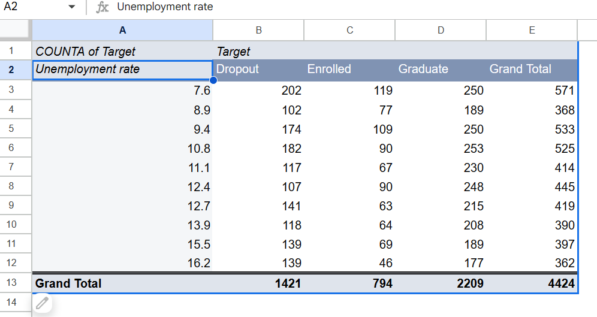

# J124 Final Project
**By Xinyi Qu**

## Story pitch:
A sizable portion of college students drop out of their higher education each year. Such choices can have a significant impact on local economies, national communities, and the country as a whole, particularly in these turbulent and difficult times. The goal of this story is to delve deeply into the causes of these dropout rates by establishing linkages between seemingly unrelated economic and socio-cultural characteristics, such as macroeconomic performance metrics (e.g. GDP growth & unemployment rate) and demographic data on the student body (e.g. gender & parent occupation). This story will provide a multidimensional view of student dropout rates by establishing links between economic variables, sociocultural norms, and individual decisions. The aim is not just to understand the problem but to highlight intervention areas that can alleviate the situation.

## Dataset:
- Dataset: [Predict students' dropout and academic success. ](https://www.kaggle.com/datasets/thedevastator/higher-education-predictors-of-student-retention)The link will redirect to Kaggle. 
- Original Source: [Predicting Student Dropout and Academic Success](https://www.mdpi.com/2306-5729/7/11/146) Valentim Realinho, Jorge Machado, Luís Baptista and Mónica V. Martins

## Data analysis and visualization

### Question 1 How are student academic outcomes distributed?  

#### Data Analysis Process:
1. Created a pivot table for the student academic outcome.
2. Filter out the missing values (blanks)
3. Calculated the percentage of each category using the formula B2/B5, for example, the percentage of students who dropped out = number of dropout / total number
4. Change the data format into percentage.

#### Data visualization: Bar chart

### Question 2 How student academic outcomes differed by gender? 

#### Data Analysis Process:
1. Created a pivot table for the student academic outcome and gender.
2. Calculated the percentage of each category using the formula B3/E3, for example, the percentage of woman who dropped out = number of female who dropped out / number of total female
3. Change the data format into percentage.

#### Data visualization: Stacked chart

### Question 3 How student academic outcomes influenced by macroeconomic performance?

#### Data Analysis Process:

1. Generated a new dummy variable to label the macroeconomic performance: 
    1. Added a new column with a copy of the “GDP” variable 
    2. Filter by condition
    3. When data is greater than zero, replace to positive growth
    4. When data is less than zero, replace to negative growth
2. Created a pivot table for the student academic outcome and macroeconomic performance.
3. Calculated the percentage of each category using the formula B3/E3, for example, the percentage of dropout when the economy experiences positive GDP growth = number of dropout / number of total sample in positive economic growth
4. Change the data format into percentage.

#### Data visualization: Split bars

### Question 4 How student academic outcomes differed by mother’s occupation?

#### Data Analysis Process:
1. Created a pivot table for the student academic outcome and mom’s occupations.
2.  Removed the missing values by filing out the blanks.  

3. Copied the values into a new table and calculated: 
   1. the dropout percentage for each mother’s occupation using the formula is B2/E2; 
   2. the enrolled percentage using the formula is C2/E2; 
   3. the graduated percentage using the formula is D2/E2.
4. Change the data format into percentage. 
5. Sorted the sheet in descending order by percentage.

#### Data visualization: Table

### Question 5 How student academic outcomes influenced by unemployment rate?

#### Data Analysis Process:
1. Created a pivot table for the student academic outcome and unemployment rates.
2. Copied the values into a new table and calculated 1) the dropout percentage for each level of unemployment rate, using the formula: D2/G2
3. Change the data format into percentage.

#### Data visualization: Scatterplot

## Potential source list:
1. Specialist: 
Tolani Britton, a scholar of higher education policy, has been promoted to associate professor with tenure at the Berkeley School of Education. 
Email: tabritton@berkeley.edu. 
Address: Office 4113, 2121 Berkeley Way. 
Phone: (914) 216-1709. Berkeley, CA 94704

2. People who may solve this issue:
Dr. Miguel Cardona, Secretary of Education
Phone number, (202) 456-1111
